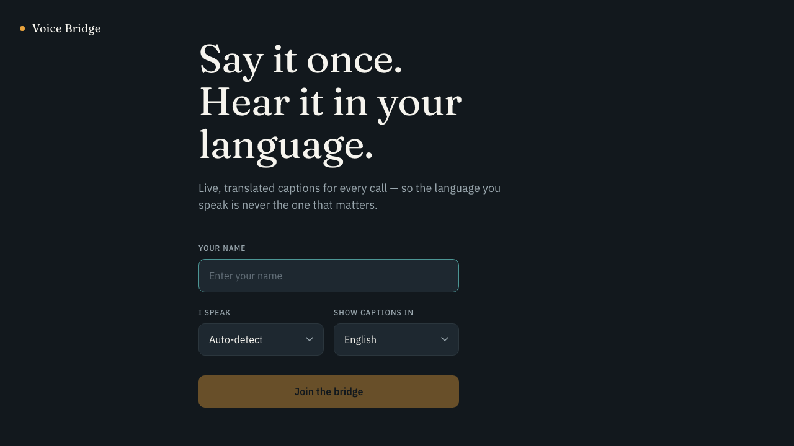
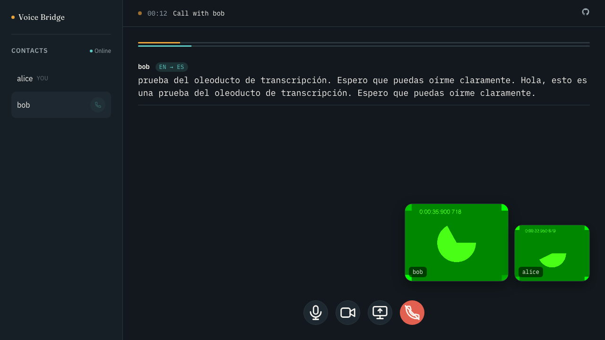

# Voice Bridge

**Video calls where language doesn't matter.** Voice Bridge is a WebRTC video-calling app with near-real-time, bidirectional live captions: each participant's speech is transcribed and translated into the *other* participant's language as they talk.





## How it works

- Peer-to-peer WebRTC video/audio (plus screen share), signaled over Socket.io.
- Each participant streams **their own mic audio** to a FastAPI backend over a WebSocket (16kHz PCM via an `AudioWorklet`).
- The backend runs voice-activity detection to find speech segments, transcribes them with local [faster-whisper](https://github.com/SYSTRAN/faster-whisper), translates the text into the *peer's* chosen language, and pushes it back as a caption — so each caller reads the other's words in their own language.
- Translation is **free and offline by default** ([Argos Translate](https://github.com/argosopentech/argos-translate), no API key); Google Cloud Translation is available as an opt-in for higher quality.
- At login you choose the language you **speak** (or auto-detect) and the language you want **captions in**.

## Architecture

| Service | Stack | Port | Role |
|---|---|---|---|
| `server.js` | Node, Express, Socket.io | 9000 | Call signaling + serves the built frontend |
| `backend/` | Python, FastAPI, faster-whisper, Argos | 8000 | VAD → transcription → translation → caption relay |
| `frontend/` | React, TypeScript, Vite | 5173 (dev) | Caption-first call UI |

## Quick start

Prerequisites: Node 18+, Python 3.11 or 3.12, a webcam/mic.

```bash
# 1. Signaling server (repo root)
npm install
npm start                          # :9000

# 2. Transcription backend
cd backend
python3.12 -m venv .venv && source .venv/bin/activate
pip install -r requirements.txt
cp .env.example .env
uvicorn app.main:app --port 8000   # first start downloads the whisper model

# 3. Frontend (dev, with HMR)
cd frontend
npm install
npm run dev                        # :5173, proxies signaling to :9000
```

Open `http://localhost:5173` in two browser windows (use a normal + an incognito window so they don't fight over the mic), join with different names and languages, and call one from the other.

**Production build:** `npm run build` (from the repo root) builds the frontend; `npm start` then serves the whole app at `http://localhost:9000` — no Vite server needed.

## Configuration

Backend (`backend/.env`, prefix `TRANSCRIBE_` — see `backend/.env.example` for the full list):

| Variable | Default | Notes |
|---|---|---|
| `WHISPER_MODEL_SIZE` | `small` | `tiny`/`base` for weaker CPUs, `medium`+ for GPU |
| `WHISPER_DEVICE` / `WHISPER_COMPUTE_TYPE` | `cpu` / `int8` | set `cuda` / `float16` on an NVIDIA host |
| `TRANSLATION_PROVIDER` | `argos` | `argos` (free, offline) \| `google` (needs API key) \| `passthrough` |
| `GOOGLE_TRANSLATE_API_KEY` | – | only used with the `google` provider |

Frontend (`frontend/.env`, see `frontend/.env.example`):

| Variable | Notes |
|---|---|
| `VITE_TRANSCRIBE_WS_URL` | Transcription backend's WebSocket URL (`ws://localhost:8000` dev, `wss://…` prod) |
| `VITE_TURN_URL` / `VITE_TURN_USERNAME` / `VITE_TURN_CREDENTIAL` | Optional dedicated TURN relay for reliable cross-network calls (comma-separated URLs allowed). Unset → falls back to a shared public relay. See [DEPLOY.md](DEPLOY.md). |

All `VITE_*` vars are baked in at **build time** — set them before `npm run build`, not after.

## Testing without a browser

`backend/scripts/simulate_call.py` drives the whole pipeline with two fake WebSocket clients and a WAV file — see `backend/README.md` for details, including how to generate a speech sample with macOS `say`.

## Deploying

**[DEPLOY.md](DEPLOY.md)** has a concrete, free walkthrough: backend on Hugging Face Spaces (Docker, 16GB RAM), frontend + signaling on Render, both wired up via `backend/Dockerfile` and `render.yaml` already in this repo. Two things baked in that matter for any deployment, not just that one:

1. **HTTPS everywhere** — browsers only allow camera/mic access on secure origins, so the frontend must be served over `https://` and `VITE_TRANSCRIBE_WS_URL` must be `wss://`.
2. **TURN for real-world WebRTC** — STUN alone fails between users behind strict/symmetric NATs (common on mobile networks); `frontend/src/lib/peerConnection.ts` already includes free [Open Relay](https://www.metered.ca/tools/openrelay/) TURN servers alongside STUN.

## Limitations

- Two-party calls only; no auth; in-memory state (a server restart drops the roster and any active call).
- Argos translation quality trails paid APIs on idioms and technical terms — swap in the `google` provider if that matters.
- Captions arrive per speech segment (after you pause), not word-by-word.

## License

[MIT](LICENSE)
